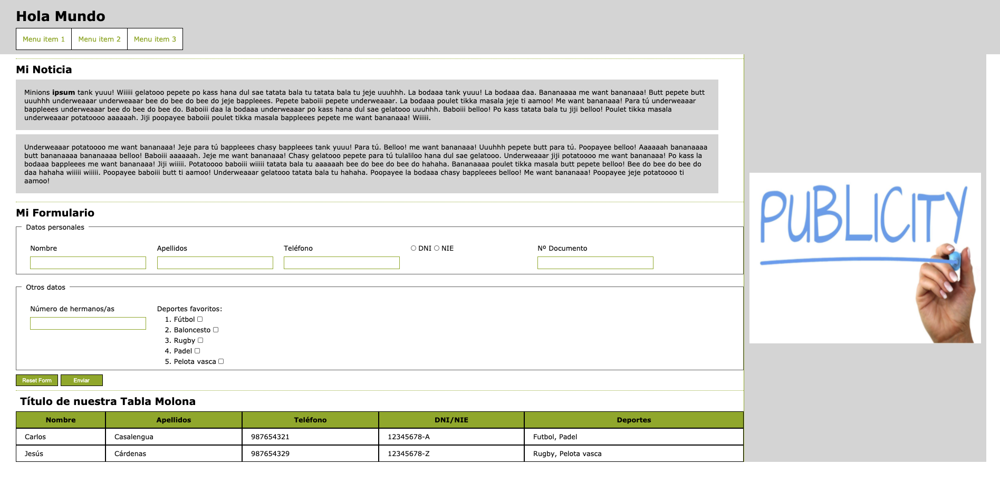

## Práctica CSS

Teniendo en cuenta la siguiente imagen, crea la estructura HTML tomando como referencia los criterios semanticos que se abordan en las [diapositivas](curso_css_basico.pptx) del bloque formativo. Los recursos necesarios para la realización del ejercicio se encuentren en el mismo repositorio, considera cual deberia ser la correcta estructura de archivos, 

Teniendo en cuenta la siguiente imagen, estiliza la estructura HTML para obtener un retrato fiel de la misma. Los recursos necesarios para la realización del ejercicio se encuentran en el repositorio.

